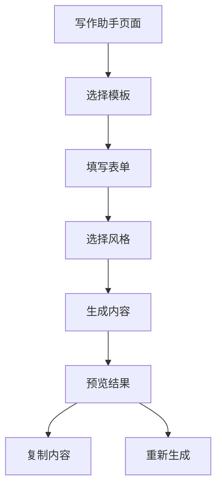

## 1. 产品概述
升级写作助手是一个单页应用，帮助用户快速生成和优化文本内容。用户可以选择写作模板、填写表单信息、选择写作风格，并实时预览生成的内容。

目标用户是需要快速创作内容的写作者、学生、职场人士，通过AI辅助提升写作效率和质量。

## 2. 核心功能

### 2.1 功能模块
升级写作助手包含以下核心页面：
1. **写作助手页面**：模板选择、表单填写、风格选择、内容预览。

### 2.2 页面详情
| 页面名称 | 模块名称 | 功能描述 |
|---------|---------|---------|
| 写作助手页面 | 模板选择区域 | 显示可用写作模板列表，支持点击选择 |
| 写作助手页面 | 表单输入区域 | 根据选中模板显示对应输入字段，支持文本输入和下拉选择 |
| 写作助手页面 | 风格选择器 | 提供多种写作风格选项（正式、轻松、学术等） |
| 写作助手页面 | 内容预览区域 | 实时显示生成的文本内容，支持复制功能 |
| 写作助手页面 | 操作按钮区域 | 包含生成内容、复制内容、重置表单等操作按钮 |

## 3. 核心流程
用户操作流程：
1. 用户进入写作助手页面
2. 选择写作模板（如论文、邮件、报告等）
3. 填写模板对应的表单信息
4. 选择期望的写作风格
5. 点击生成按钮获取内容
6. 在预览区域查看生成的文本
7. 可复制内容或重新生成

## 4. 用户界面设计

### 4.1 设计风格
- **主色调**：蓝色系（#2563eb）体现专业和可信赖
- **辅助色**：灰色系（#6b7280）用于次要元素
- **按钮样式**：圆角矩形，主要按钮使用主色调
- **字体**：系统默认字体，标题16-18px，正文14px
- **布局风格**：卡片式布局，左右分栏设计
- **图标风格**：使用简洁的线性图标

### 4.2 页面设计概述
| 页面名称 | 模块名称 | UI元素 |
|---------|---------|---------|
| 写作助手页面 | 模板选择区域 | 网格布局展示模板卡片，包含图标和名称，选中状态高亮显示 |
| 写作助手页面 | 表单输入区域 | 左侧栏垂直排列输入框，标签清晰，占位符提示明确 |
| 写作助手页面 | 风格选择器 | 下拉选择框或按钮组形式，直观显示各风格特点 |
| 写作助手页面 | 内容预览区域 | 右侧栏展示，白色背景，边框装饰，支持语法高亮 |
| 写作助手页面 | 操作按钮区域 | 底部固定位置，主要按钮突出显示，次要按钮简约设计 |

### 4.3 响应式设计
- 采用桌面优先设计，默认适配1920x1080分辨率
- 支持响应式布局，在平板和手机上自适应显示
- 移动端采用单列布局，模板选择和预览区域垂直排列