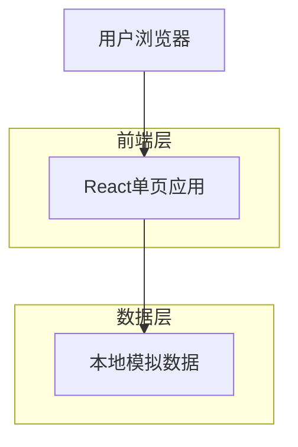
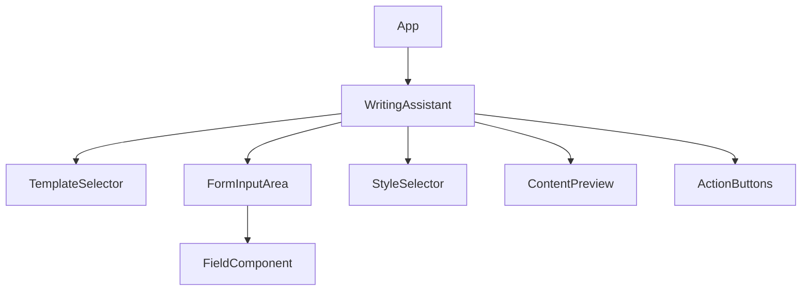

## 1. 架构设计



## 2. 技术描述

- **前端**: React@18 + tailwindcss@3 + vite
- **初始化工具**: vite-init
- **后端**: 无（使用本地模拟数据）
- **状态管理**: React Hooks（useState, useEffect）
- **UI组件**: 自定义组件 + Tailwind CSS

## 3. 路由定义

| 路由 | 用途 |
|-------|---------|
| / | 写作助手主页面，包含所有功能模块 |

## 4. 核心数据结构

### 4.1 模板数据结构
```typescript
interface WritingTemplate {
  id: string;
  name: string;
  description: string;
  icon: string;
  fields: TemplateField[];
}

interface TemplateField {
  id: string;
  label: string;
  type: 'text' | 'textarea' | 'select';
  placeholder?: string;
  options?: string[];
  required: boolean;
}
```

### 4.2 风格选项数据结构
```typescript
interface WritingStyle {
  id: string;
  name: string;
  description: string;
  prompt: string;
}
```

### 4.3 内容生成请求数据结构
```typescript
interface ContentGenerationRequest {
  templateId: string;
  fieldValues: Record<string, string>;
  styleId: string;
}

interface ContentGenerationResponse {
  content: string;
  success: boolean;
  error?: string;
}
```

## 5. 本地模拟数据设计

### 5.1 模板数据
```javascript
const writingTemplates = [
  {
    id: 'essay',
    name: '学术论文',
    description: '适用于学术写作和研究报告',
    icon: '📝',
    fields: [
      { id: 'topic', label: '论文主题', type: 'text', placeholder: '请输入论文主题', required: true },
      { id: 'keywords', label: '关键词', type: 'text', placeholder: '请输入关键词，用逗号分隔', required: true },
      { id: 'wordCount', label: '字数要求', type: 'select', options: ['500', '1000', '2000'], required: true }
    ]
  },
  {
    id: 'email',
    name: '商务邮件',
    description: '适用于商务沟通和邮件写作',
    icon: '📧',
    fields: [
      { id: 'recipient', label: '收件人', type: 'text', placeholder: '请输入收件人姓名或职位', required: true },
      { id: 'purpose', label: '邮件目的', type: 'select', options: ['询价', '投诉', '感谢', '邀请'], required: true },
      { id: 'tone', label: '语气要求', type: 'select', options: ['正式', '友好', '紧急'], required: true }
    ]
  }
];
```

### 5.2 写作风格数据
```javascript
const writingStyles = [
  { id: 'formal', name: '正式', description: '适用于商务和学术场合', prompt: '使用正式、客观的语调' },
  { id: 'casual', name: '轻松', description: '适用于日常交流', prompt: '使用轻松、友好的语调' },
  { id: 'academic', name: '学术', description: '适用于论文写作', prompt: '使用学术性语言和严谨的逻辑' },
  { id: 'creative', name: '创意', description: '适用于创意写作', prompt: '使用富有想象力和创造性的表达' }
];
```

## 6. 组件架构

### 6.1 主组件结构


### 6.2 状态管理设计
- **当前选中模板**: 使用useState管理
- **表单字段值**: 使用useState管理对象形式的状态
- **选中风格**: 使用useState管理
- **生成内容**: 使用useState管理
- **加载状态**: 使用useState管理加载和错误状态

## 7. 模拟内容生成逻辑

### 7.1 内容生成函数
```typescript
function generateContent(templateId: string, fieldValues: Record<string, string>, styleId: string): string {
  // 根据模板ID获取模板信息
  const template = writingTemplates.find(t => t.id === templateId);
  // 根据风格ID获取风格信息
  const style = writingStyles.find(s => s.id === styleId);
  
  // 基于模板和字段值生成模拟内容
  // 实际项目中这里会调用AI API
  return `根据您的要求，我为您生成了一篇${template?.name}，
主题：${fieldValues.topic || fieldValues.purpose}，
风格：${style?.name}，
内容：这里是生成的文本内容...`;
}
```

## 8. 样式设计规范

### 8.1 CSS类命名规范
- 使用Tailwind CSS工具类
- 自定义组件类名使用BEM命名法：`.component-name__element--modifier`
- 响应式类名遵循Tailwind的断点规则

### 8.2 颜色系统
- 主色调：`blue-600` (#2563eb)
- 辅助色：`gray-500` (#6b7280)
- 背景色：`gray-50` (#f9fafb)
- 边框色：`gray-200` (#e5e7eb)

### 8.3 间距系统
- 基于Tailwind的间距单位
- 组件内边距：p-4
- 组件外边距：m-2
- 标题间距：mb-4